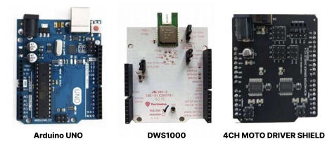
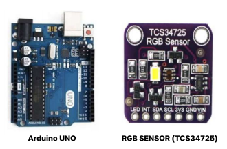
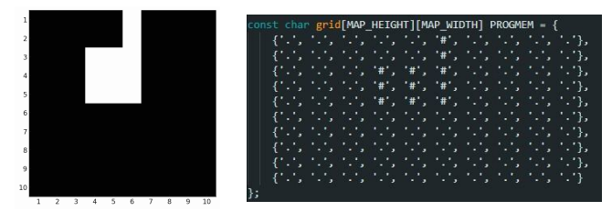
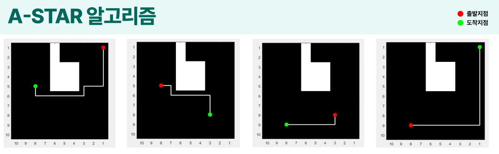
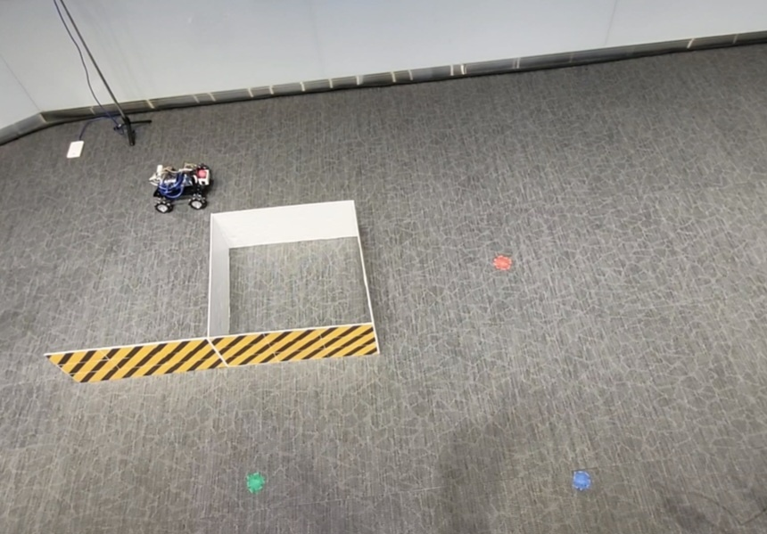
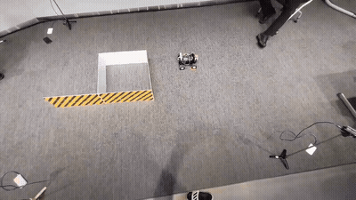

# UWB 기반 물류 자동화 로봇

UWB(Ultra-Wideband) 통신만을 이용한 실내 위치추정과 A* 경로계획으로, 물품 색상에 따라 목적지까지 자율주행하는 물류 자동화 로봇입니다.

**한국전자파학회(KIEES) 2024년 하계종합학술대회 논문/포스터 발표작**

---

## 배경 및 목표

물류 산업은 인력난과 고령화로 로봇 자동화의 필요성이 커지고 있지만, 기존 물류 로봇은 LiDAR나 카메라 기반이라 고가의 센서가 필요해 대중화에 한계가 있습니다.

이 프로젝트는 **UWB 무선통신만으로** 실내 물류 창고 환경에서 위치를 추적하고, 물품을 분류해 목적지까지 자동으로 배송하는 저비용 로봇 모델을 구현하는 것을 목표로 했습니다.

- Wi-Fi, Bluetooth, GPS 대비 UWB는 초광대역 주파수로 실내에서 더 정밀한 위치 추적이 가능
- 카메라/LiDAR 없이 저비용 구성으로도 자율주행이 가능함을 검증

---

## 주요 기능

| 구분 | 설명 |
|---|---|
| 📍 **UWB 삼각측량** | Anchor 3개와의 거리 정보(TWR)로 로봇의 실시간 (x, y) 좌표 계산 |
| 🗺️ **맵 기반 경로계획** | A* 알고리즘으로 장애물을 피해 목적지까지 최단 경로 탐색 |
| 🎨 **RGB 기반 목적지 할당** | 물품 색상을 인식해 해당하는 목적지 좌표로 자동 매핑 |
| 🎮 **자연스러운 주행 제어** | UWB 오차(±10cm)를 고려한 임계값 기반 도착 판정으로 모터 떨림 방지 |
| 📊 **노이즈 저감** | 이동평균 필터로 좌표 튐(outlier) 완화 |

---

## 시스템 구성

```
[ Anchor A ]     [ Anchor B ]     [ Anchor C ]
      \               |                /
       \______ UWB 거리 정보(TWR) ______/
                      ↓
             [ tag_sender (메인 아두이노) ]
              - 3개 anchor와의 거리로 삼각측량
              - 이동평균 필터로 좌표 노이즈 저감
              - 실시간 (x, y) 좌표 계산 및 송신
                      ↓ 시리얼 통신
           [ receiver_controller (서브 아두이노) ]
              - RGB 센서로 물품 색상 인식 → 목적지 좌표 할당
              - A* 알고리즘으로 현재 위치 → 목적지 최단 경로 계산
              - tag 좌표와 목표 경로 비교하여 모터 구동
                      ↓
              [ 4채널 모터 드라이버 + 맥넘휠 ]
                      ↓
                 로봇 주행 (자율 이동)
```

### 하드웨어 구성
- Arduino UNO x5 (Anchor A/B/C, tag_sender, receiver_controller)
- DWS1000 UWB 모듈 x4 (Anchor 3개 + Tag 1개)
- TCS34725 RGB 센서 (물품 색상 인식)
- 4채널 모터 드라이버 실드
- 맥넘휠 섀시 (제자리 회전 없는 전방향 이동)

**tag_sender 부품 구성**



**receiver_controller 부품 구성**



---

## 핵심 기술

### 1. UWB 삼각측량 (Trilateration)
3개의 anchor(고정 위치)와 로봇에 장착된 tag 간 TWR(Two-Way Ranging) 거리 정보를 0.1초마다 수신, 연립방정식을 풀어 로봇의 실시간 (x, y) 좌표를 계산했습니다.

각 anchor 좌표를 (x₁,y₁), (x₂,y₂), (x₃,y₃), 로봇 좌표를 (x,y), 각 anchor와의 거리를 d₁, d₂, d₃라 할 때:

```
d₁ = √((x-x₁)² + (y-y₁)²)
d₂ = √((x-x₂)² + (y-y₂)²)
d₃ = √((x-x₃)² + (y-y₃)²)
```

위 방정식을 풀어 현재 로봇의 좌표 (x, y)를 특정했습니다.

### 2. 이동평균 필터를 통한 노이즈 저감
UWB 삼각측량 특성상 발생하는 위치 측정 노이즈를 줄이기 위해, 칼만 필터 대신 **이동평균 필터(Moving Average Filter)**를 적용했습니다. 최근 N개의 좌표 샘플을 평균 내어 튀는 값(outlier)을 완화하는 방식으로, 구현 복잡도 대비 실내 소규모 환경에서 충분한 안정성을 확보했습니다.

### 3. A* 경로계획 알고리즘
- 실내 물류 창고 맵을 2차원 배열(`.`은 빈 공간, `#`은 장애물)로 표현
- heap 기반 우선순위 큐를 직접 구현해 open list 관리
- Heuristic 값은 현재 위치에서 목적지까지의 **맨해튼 거리**로 설정
- Arduino 메모리 제약으로 맵 해상도를 27x27 → 10x10으로 축소, 좌표 간격 30cm로 스케일링해 로봇 크기(25x27.5cm) 대비 장애물과의 여유 확보
- 로봇 크기를 고려해 3x3 범위 내 장애물이 없는 경로만 선택

MATLAB과 아두이노 코드로 구상한 맵과 그리드 표현:



MATLAB으로 사전에 A* 경로 알고리즘을 검증한 결과 (다양한 출발/도착 조합):



### 4. 임계값 기반 도착 판정
UWB의 실내 오차(±10cm)를 그대로 적용하면 좌표가 미세하게 흔들려 모터가 떨리는 문제가 있었습니다. 목표 좌표와의 거리가 **10cm 이내**면 도착한 것으로 판정하는 임계값 방식을 적용해 자연스러운 정지 동작을 구현했습니다.

---

## 동작 시나리오

1. 물품이 RGB 센서 앞에 놓이면 색상을 인식 (예: 빨강 → A구역, 파랑 → B구역)
2. 인식된 색상에 매핑된 목적지 좌표를 서브 아두이노(receiver_controller)가 로드
3. 메인 아두이노(tag_sender)가 3개 anchor로부터 받은 거리 데이터로 현재 위치 계산 후 송신
4. receiver_controller가 현재 위치 → 목적지까지 A* 최단 경로를 계산
5. 계산된 경로를 따라 모터를 구동, 목적지 10cm 이내 도달 시 정지
6. 도착 후 현재 위치를 새로운 출발점으로 업데이트, 다음 물품 대기

### 실제 구현 환경

논문 스펙(3m x 3m)과 동일한 크기로 구현한 실내 물류 창고 맵입니다.



### 시연



[전체 시연 영상 보기](docs/demo-full.mp4)

---

## 디렉토리 구조

```
UWB_logistics_robot/
├── README.md
├── firmware/
│   ├── anchor_A/              # Anchor A 펌웨어 (DWS1000 라이브러리 예제 기반)
│   ├── anchor_B/              # Anchor B 펌웨어
│   ├── anchor_C/              # Anchor C 펌웨어
│   ├── tag_sender/            # 메인 아두이노 — 삼각측량 및 좌표 송신
│   └── receiver_controller/   # 서브 아두이노 — 경로계획 및 모터 제어
├── docs/                      # 시스템 구성도, 데모 GIF, 결과 이미지
└── paper/                     # 학회 논문 및 포스터 (KIEES 2024)
```

---

## 담당 역할

4인 팀 프로젝트 중 다음 두 부분을 담당했습니다.

- **RGB 센서 인식 기반 목표 지점 이동**: RGB 센서로 물품 색상을 인식해 정해진 목적지 좌표로 로봇이 이동하도록 구현
- **이동평균 필터를 통한 위치 측정 정확도 개선**: UWB 삼각측량 과정에서 발생하는 좌표 노이즈를 이동평균 필터로 완화

